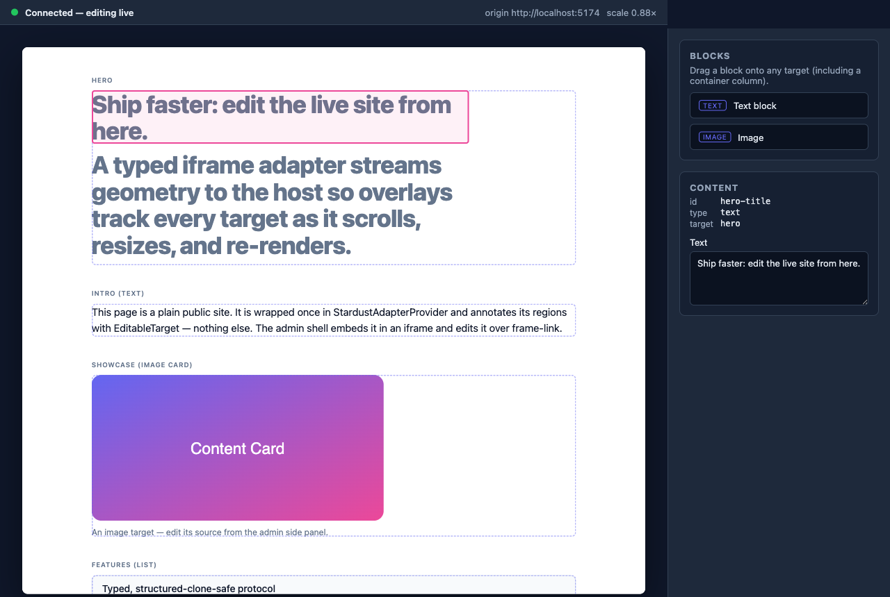

# @stardust-cms/iframe-adapter

A drop-in toolkit for building **in-iframe visual editors**. Embed any site in an
iframe and map its editable elements to overlay controls in your host
application — selection handles, drag-and-drop, live content and style updates —
without the host ever touching the embedded document's DOM. Built on
[`frame-link`](https://www.npmjs.com/package/frame-link) for a typed,
promise-based `postMessage` transport, with a serializable protocol that is safe
to send across the frame boundary and reusable from non-React and server-side
code.

## Why it exists

Visual editors that live outside the page they edit have to solve one hard
problem cleanly: the editing chrome (overlays, handles, side panels) lives in the
**host** window, while the content it edits lives inside a sandboxed **iframe**.
The two can only talk over `postMessage`, everything on the wire must be
serializable, and geometry has to stay aligned as the inner page scrolls and
resizes. This package draws that boundary once, correctly, and hands you both
sides.

## What you get

- **A typed message protocol.** Every host↔iframe message is a namespaced
  `cms/*` key with a request/response payload type, keyed off `frame-link`'s
  generic message API so handlers infer their payloads automatically.
- **Serializable geometry.** Raw `DOMRect` never crosses the boundary. A plain
  `Geometry` value (`top/right/bottom/left/width/height/x/y`) is guaranteed to
  survive the structured-clone algorithm `postMessage` uses — proven by
  round-trip tests, enforced by compile-time assertions.
- **A clean host/iframe split.** Separate `./host` and `.` (iframe) entry points
  mean a public site bundle never ships host overlay code, and the host bundle
  never ships the iframe provider. A React-free `./protocol` subpath lets other
  services import just the types.

## Package layout

| Import                                | Use in            | Contents                                             |
| ------------------------------------- | ----------------- | ---------------------------------------------------- |
| `@stardust-cms/iframe-adapter`        | embedded site     | iframe-side adapter (alias of `./iframe`)            |
| `@stardust-cms/iframe-adapter/host`   | host/admin shell  | host-side overlay adapter                            |
| `@stardust-cms/iframe-adapter/protocol` | anywhere        | framework-agnostic types + message registry (React-free) |

## Protocol at a glance

```ts
import type {
  Geometry,        // serializable rect: { top,right,bottom,left,width,height,x,y }
  ScrollState,     // { h, y, isTop, isBottom }
  ContentTarget,   // { targetId, isContainer, geometry, children }
  ChildContent,    // { contentId, index, isContainer, styleGroup, geometry }
  StardustMessageRegistry,
} from "@stardust-cms/iframe-adapter/protocol";
```

| Message key                    | Direction     | Request → Response          |
| ------------------------------ | ------------- | --------------------------- |
| `cms/requestTargetPositions`   | host → iframe | `void` → `ContentTarget[]`  |
| `cms/sendElements`             | host → iframe | `ContentPayload` → `void`   |
| `cms/updateStyles`             | host → iframe | `StyleUpdatePayload` → `void` |
| `cms/sendElementPositions`     | iframe → host | `ContentTarget[]` → `void`  |
| `cms/sendScrollPositions`      | iframe → host | `ScrollState` → `void`      |

The iframe discovers targets/content from `data-cms*` attributes and publishes
geometry; the host maps that geometry into overlay space and issues content and
style intents. The host never reads the iframe DOM directly, and the iframe
never knows overlays exist. See [`docs/responsibilities.md`](docs/responsibilities.md)
for the full ownership table.

## Live demo

A runnable demo pair shows the adapter end to end: a plain public **site** and an
**admin** shell that embeds it in an iframe and edits it live over `frame-link`.



The admin (left) renders the scaled site inside an iframe with overlays tracking
every editable target; the sidebar (right) has a block palette and a content
panel. Editing the hero text in the panel updates the iframe **live** and the
overlay stays glued to the re-rendered content.

### What the demo demonstrates

- **Multiple editable targets, one a nested container.** The site annotates five
  top-level targets — `hero`, `intro`, `showcase` (image), `features` (list), and
  `split` — where `split` holds a `container` content item that expands into two
  nested container targets (`split-col.1` / `split-col.2`), each holding its own
  child blocks (seven discoverable targets in total). Every target and container
  child is individually addressable, so its geometry streams and its overlay
  lands precisely.
- **Overlays that track geometry** under window resize (the iframe re-scales) and
  under iframe scroll — guarded by the Playwright E2E.
- **Live content editing:** select → edit in the side panel (or add / move /
  delete via the overlays and palette) → the change flows through an in-memory
  content store → `cms/sendElements` → the site re-renders → overlays remap.
- **Explicit-origin security (never `*`):** the admin↔site handshake uses
  explicit `http://localhost:5173` / `http://localhost:5174` origins on both
  ends (see [Security](#security)).

### Run it (one command)

From a fresh clone, after `npm install`:

```sh
npm run demo
```

This starts both dev servers concurrently on their explicit origins:

- **admin (host):** <http://localhost:5173> ← open this one
- **site (iframe):** <http://localhost:5174>

Open the admin URL. Within a moment the status strip turns green
("Connected — editing live") and overlays appear over the embedded site.

Useful sibling scripts:

| Script | What it does |
| --- | --- |
| `npm run demo` | Start both apps (admin + site) for the interactive demo. |
| `npm run demo:test` | Run the demo unit + component tests (content store, editing layer). |
| `npm run demo:e2e` | Run the Playwright E2E (overlay alignment + live injection). Run `npx playwright install chromium` first. |
| `npm run demo:typecheck` | Type-check both demo apps. |
| `npm run demo:build` | Production-build both demo apps. |

### Five-minute reviewer walkthrough

1. `npm install && npm run demo`, then open <http://localhost:5173>.
2. Wait for the green **Connected — editing live** status. Overlays outline every
   target on the scaled site.
3. **Click the hero headline overlay.** It gets a selection ring and the
   right-hand **Content** panel populates (id / type / target + a text field).
4. **Edit the text field.** The hero text in the iframe updates as you type, and
   the overlay stays aligned to the re-rendered heading. This is the core
   value: editing a live site through a typed iframe protocol.
5. **Drag a block** from the **Blocks** palette into any target — including a
   `split` container column — to insert new content; use the **×** on an item to
   delete it. **Resize the window** and watch overlays keep tracking as the
   iframe re-scales.

### Recording a GIF / video for a portfolio

To capture the edit-and-update flow (the most compelling few seconds):

1. Start the demo (`npm run demo`) and open the admin at a tidy window size
   (~1280×860 gives the layout in the screenshots).
2. Record the admin window with any screen recorder:
   - **macOS:** `Cmd-Shift-5` → *Record Selected Portion* (or QuickTime →
     *New Screen Recording*).
   - **Cross-platform:** [OBS Studio](https://obsproject.com), or the
     [LICEcap](https://www.cockos.com/licecap/) / [Kap](https://getkap.co) GIF
     recorders.
3. Record ~8–12 seconds of the walkthrough: select the hero → type in the panel →
   show the iframe updating → drag a palette block into a container → resize the
   window so overlays re-track.
4. Trim, export a GIF (≤ ~5 MB for READMEs) or an MP4, and save it under
   `docs/demo/`. Reference it from this section the same way the screenshot above
   is embedded.

Static screenshots for reference live in [`docs/demo/`](docs/demo/):
`admin-overview.png` (connected, overlays, empty panel) and `admin-editing.png`
(mid-edit, selection ring + live update).

## Installation

```sh
npm install @stardust-cms/iframe-adapter frame-link frame-link-react
```

`frame-link`, `frame-link-react`, and `react >=18` are peer dependencies.

## Security

Transport target origins are always explicit — no wildcard `*` `postMessage`
origins appear anywhere in this package. Configure the target origin through
`frame-link`'s options.

## Status

The framework-agnostic protocol layer (types, message registry,
serializability guarantees) is complete. The iframe-side and host-side React
adapters build on this protocol and are delivered by the accompanying
initiatives.

## License

MIT © Daniel Cassil
